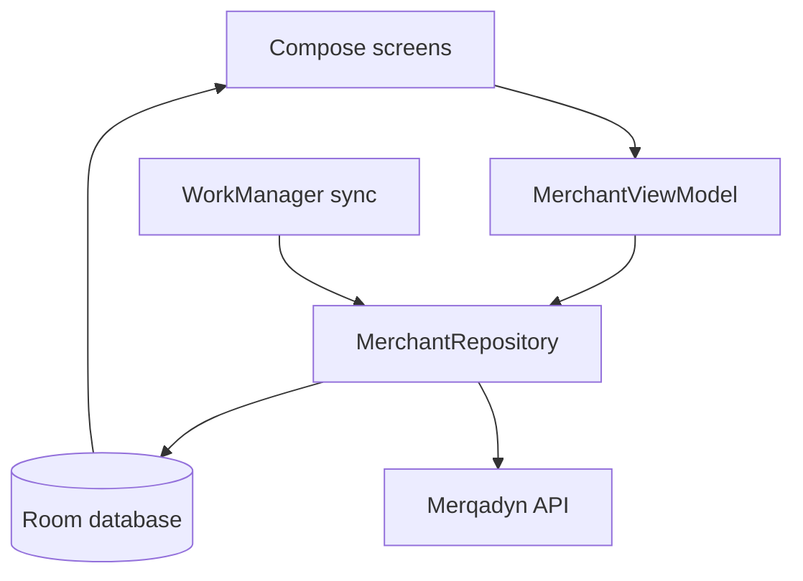

# Architecture

Merqadyn Mobile treats Room as the screen's source of truth. Network responses update Room, and Compose observes Room flows. This keeps the same screen useful whether the API is available or not.

## Responsibilities

| Area | Responsibility |
| --- | --- |
| Compose | Render local state and collect merchant input |
| ViewModel | Own screen work state and notices |
| Repository | Validate operations, queue mutations, refresh snapshots, resolve results |
| Room | Persist products, inventory, sync cursor, and mutations |
| WorkManager | Retry queued work under a network constraint and after process restarts |
| Credential store | Encrypt the device token with Android Keystore and expose the current enrollment |
| API client | Serialize the Merqadyn HTTP contract and apply device-scoped authentication |

## Configuration boundary

`BuildConfig` receives only an initial API URL and registered device ID. The app exchanges a short-lived code for a device token, then stores that token encrypted with Android Keystore. Debug builds permit cleartext traffic only to loopback and private addresses; release builds require HTTPS.

## Local inventory projection

An inventory row stores the last authoritative `serverOnHand` quantity. The UI adds deltas from queued or uploading stock mutations:

`local on hand = server on hand + sum of active queued deltas`

After the API accepts work, a refresh replaces the authoritative snapshot. Only mutations still waiting contribute to the projection, preventing an accepted delta from being counted twice.
